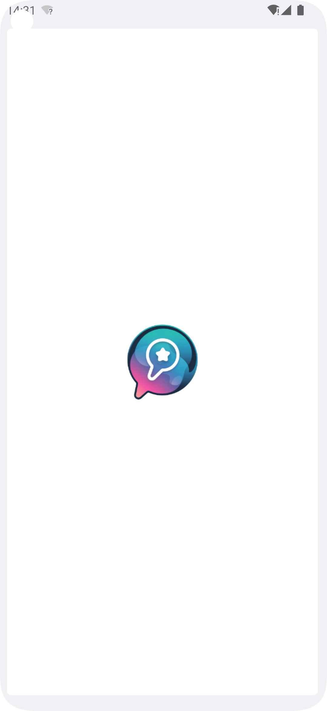
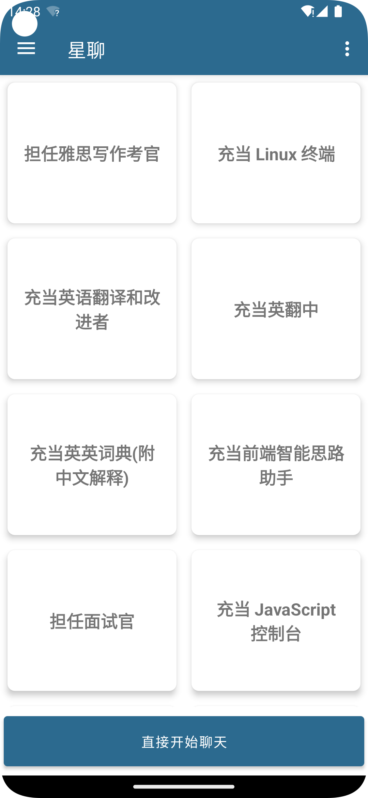
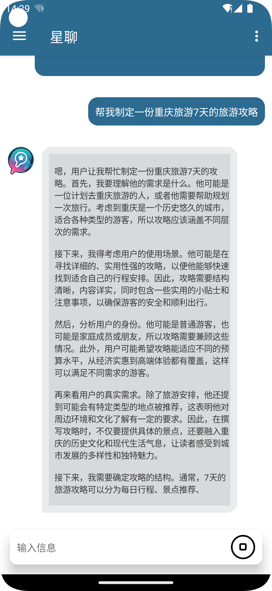
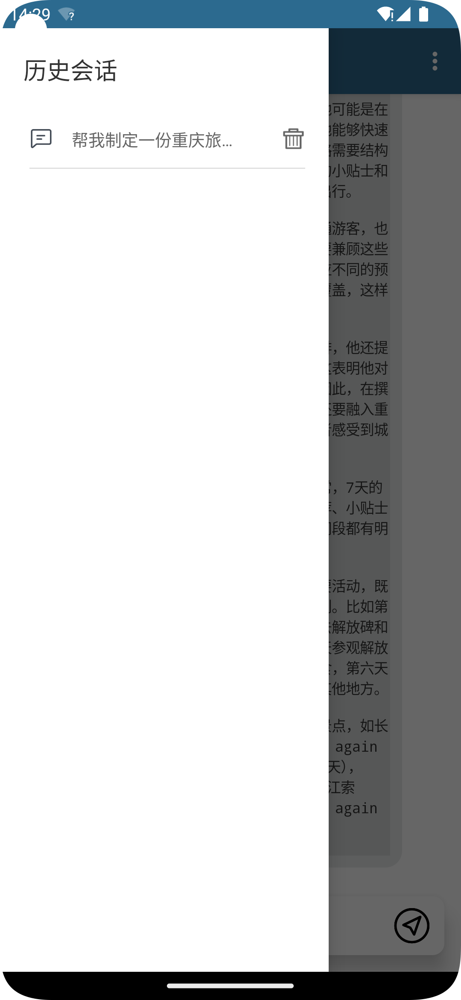

# 星聊 
一个完全本地的大模型聊天应用 
推理框架：https://github.com/alibaba/MNN 
模型：https://modelscope.cn/models/liqinchang/DeepSeek-R1-Distill-Qwen-1.5B-MNN

请用git clone --recurse-submodules或者克隆后手动下载模型并放到assets/model下 

MNN模型是我用hf的DeepSeek-R1-Distill-Qwen-1.5B转onnx再转mnn得到的，用现成的DeepSeek-R1-Distill-Qwen-1.5B-MNN也可以 

模型能力很弱，仅尝鲜用，目前移动端/边缘端对LLM的应用受限于软硬件能力，目前还没想到能有什么故事。可能未来在机器人、高端手机提供本地LLM系统服务、隐私无网以及对不太需要LLM有特别强算力的场景（比如儿童或者成人玩具?）可能有点作用吧，欢迎探讨 

---

  
  
  
  

---